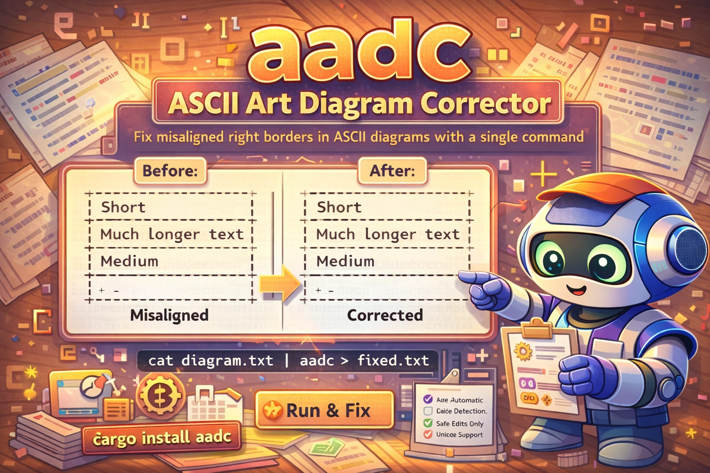

<p align="center">
  <pre>
     ██████╗  ██████╗ ██████╗  ██████╗
    ██╔══██╗██╔══██╗██╔══██╗██╔════╝
    ███████║███████║██║  ██║██║
    ██╔══██║██╔══██║██║  ██║██║
    ██║  ██║██║  ██║██████╔╝╚██████╗
    ╚═╝  ╚═╝╚═╝  ╚═╝╚═════╝  ╚═════╝
  </pre>
</p>

<h3 align="center">ASCII Art Diagram Corrector</h3>

<p align="center">
  <em>Fix misaligned right borders in ASCII diagrams with a single command</em>
</p>

<p align="center">
  <a href="https://github.com/Dicklesworthstone/aadc/actions/workflows/ci.yml"></a>
  <a href="https://codecov.io/gh/Dicklesworthstone/aadc"></a>
  <a href="https://crates.io/crates/aadc"></a>
  <a href="LICENSE"></a>
</p>

<div align="center">
  
</div>

<p align="center">
  <a href="#installation">Install</a> •
  <a href="#quick-start">Quick Start</a> •
  <a href="#how-it-works">How It Works</a> •
  <a href="#command-reference">Commands</a>
</p>

---

## TL;DR

**The Problem:** You spend 10 minutes crafting a beautiful ASCII diagram, then edit the content and now all the right borders are misaligned. Manual fixing is tedious and error-prone.

```
BEFORE                          AFTER
+------------------+            +------------------+
| Short|                        | Short            |
| Much longer text |    →       | Much longer text |
| Medium|                       | Medium           |
+------------------+            +------------------+
```

**The Solution:** `aadc` automatically detects ASCII diagram blocks and aligns their right borders by adding padding—never removing content.

**Install & Run:**
```bash
cargo install aadc
cat diagram.txt | aadc > fixed.txt
```

### Why Use aadc?

| Feature | Description |
|---------|-------------|
| **Automatic Detection** | Finds diagram blocks heuristically—no markers needed |
| **Safe Edits** | Only adds padding, never removes characters |
| **Unicode Support** | Handles `│ ─ ┌ ┐ └ ┘ ╔ ╗ ╚ ╝` and ASCII `+ - \|` |
| **Iterative Correction** | Runs multiple passes until alignment converges |
| **Confidence Scoring** | Skips ambiguous blocks unless you force them with `--all` |
| **Stdin/Stdout** | Plays nice with pipes and shell scripts |

---

## Quick Example

```bash
# Create a misaligned diagram
cat << 'EOF' > diagram.txt
Here's my architecture:

┌────────────────┐
│ API Gateway|
│ Authentication │
│ Rate Limiting|
└────────────────┘

And here's the flow:

+--------+     +----------+
| Client|  →  | Server|
+--------+     +----------+
EOF

# Fix it
aadc diagram.txt

# Or fix in place
aadc -i diagram.txt

# See what's happening
aadc -v diagram.txt
```

**Output with `-v` (verbose):**
```
Processing 15 lines...
Found 2 diagram block(s)
  Block 1: lines 3-7 (confidence: 100%)
    Iteration 1: applied 2 revision(s)
    Converged after 1 iteration(s)
  Block 2: lines 11-13 (confidence: 100%)
    Iteration 1: applied 2 revision(s)
Processed 2 block(s), 4 revision(s) applied
```

---

## How It Works

### Design Philosophy

1. **Detection Over Markers**: No special comments or tags required. aadc recognizes box-drawing patterns automatically.

2. **Conservative by Default**: Only modifies lines it's confident about. Use `--all` to force processing of ambiguous blocks.

3. **Monotone Edits**: Only adds whitespace padding—never deletes characters. Your content is safe.

4. **Iterative Refinement**: Runs multiple correction passes until the alignment stabilizes or hits `--max-iters`.

5. **Scoring System**: Each proposed edit gets a confidence score. Edits below `--min-score` are skipped.

### Architecture

```
┌─────────────────────────────────────────────────────────────────┐
│                         INPUT                                   │
│  (file or stdin)                                                │
└─────────────────────────────────────────────────────────────────┘
                              │
                              ▼
┌─────────────────────────────────────────────────────────────────┐
│                     TAB EXPANSION                               │
│  Converts tabs to spaces (--tab-width)                          │
└─────────────────────────────────────────────────────────────────┘
                              │
                              ▼
┌─────────────────────────────────────────────────────────────────┐
│                   BLOCK DETECTION                               │
│  Scans for lines with box-drawing characters                    │
│  Groups consecutive "boxy" lines into blocks                    │
│  Calculates confidence score per block                          │
└─────────────────────────────────────────────────────────────────┘
                              │
                              ▼
┌─────────────────────────────────────────────────────────────────┐
│              ITERATIVE CORRECTION (per block)                   │
│  ┌────────────────────────────────────────────────────────┐     │
│  │  1. Analyze lines: find right borders                  │     │
│  │  2. Find target column (rightmost border position)     │     │
│  │  3. Generate revision candidates                       │     │
│  │  4. Score each revision                                │     │
│  │  5. Apply revisions above --min-score                  │     │
│  │  6. Repeat until converged or --max-iters reached      │     │
│  └────────────────────────────────────────────────────────┘     │
└─────────────────────────────────────────────────────────────────┘
                              │
                              ▼
┌─────────────────────────────────────────────────────────────────┐
│                         OUTPUT                                  │
│  (stdout or --in-place)                                         │
└─────────────────────────────────────────────────────────────────┘
```

### What It Recognizes

**Corners:**
```
ASCII:  +
Unicode: ┌ ┐ └ ┘ ╔ ╗ ╚ ╝ ╭ ╮ ╯ ╰
```

**Horizontal borders:**
```
ASCII:  - = ~
Unicode: ─ ━ ═ ╌ ╍ ┄ ┅ ┈ ┉
```

**Vertical borders:**
```
ASCII:  |
Unicode: │ ┃ ║ ╎ ╏ ┆ ┇ ┊ ┋
```

**Junctions:**
```
Unicode: ┬ ┴ ├ ┤ ┼ ╦ ╩ ╠ ╣ ╬ ╤ ╧ ╟ ╢ ╫ ╪
```

---

## Installation

### From Source (Recommended)

```bash
git clone https://github.com/Dicklesworthstone/aadc
cd aadc
cargo install --path .
```

### Build Only

```bash
cargo build --release
# Binary at target/release/aadc
```

**Requirements:**
- Rust nightly (Edition 2024)
- See `rust-toolchain.toml` for exact version

---

## Command Reference

```
aadc [OPTIONS] [FILE]
```

### Arguments

| Argument | Description |
|----------|-------------|
| `[FILE]` | Input file. Reads from stdin if not provided. |

### Options

| Option | Short | Default | Description |
|--------|-------|---------|-------------|
| `--in-place` | `-i` | false | Edit file in place (requires FILE) |
| `--max-iters` | `-m` | 10 | Maximum correction iterations per block |
| `--min-score` | `-s` | 0.5 | Minimum confidence score (0.0-1.0) for applying edits |
| `--tab-width` | `-t` | 4 | Tab expansion width in spaces |
| `--all` | `-a` | false | Process all diagram-like blocks, even low-confidence ones |
| `--verbose` | `-v` | false | Show correction progress |
| `--diff` | `-d` | false | Show unified diff instead of full output |
| `--dry-run` | `-n` | false | Preview changes without modifying files (exit 3 if changes would be made) |
| `--backup` |  | false | Create backup file before in-place editing (requires `--in-place`) |
| `--backup-ext` |  | `.bak` | Extension for backup files (requires `--backup`) |
| `--json` |  | false | Output results as JSON (conflicts with `--verbose`/`--diff`) |
| `--help` | `-h` | | Print help |
| `--version` | `-V` | | Print version |

### Exit Codes

| Code | Meaning |
|------|---------|
| 0 | Success |
| 1 | General error (file not found, permission denied, I/O error) |
| 2 | Invalid command-line arguments |
| 3 | Dry-run mode: changes would be made |
| 4 | Parse error (invalid UTF-8 or binary input) |

### Examples

```bash
# Basic: stdin to stdout
cat file.txt | aadc

# File to stdout
aadc diagram.txt

# Edit in place
aadc -i diagram.txt

# Verbose mode
aadc -v diagram.txt

# More aggressive (lower threshold)
aadc --min-score 0.3 diagram.txt

# Process everything
aadc --all diagram.txt

# Custom tab width
aadc --tab-width 2 diagram.txt

# Combine options
aadc -i -v --max-iters 20 --min-score 0.4 diagram.txt
```

---

## Comparison vs Alternatives

| Tool | Auto-Detect | Safe Edits | Unicode | Iterative | CLI |
|------|-------------|------------|---------|-----------|-----|
| **aadc** | Yes | Yes | Yes | Yes | Yes |
| Manual editing | N/A | No | Yes | N/A | N/A |
| sed/awk scripts | No | No | Partial | No | Yes |
| Editor plugins | Varies | Varies | Varies | No | No |

**Why not just use sed?**
- sed requires you to know the exact column positions
- sed can easily delete content if the pattern is wrong
- sed doesn't understand diagram structure

**Why not use an editor plugin?**
- Not scriptable
- Doesn't batch process files
- Many don't detect diagram boundaries automatically

---

## Troubleshooting

### "No diagram blocks found"

**Cause:** Your diagram doesn't have recognizable box-drawing characters on both sides of lines.

**Fix:** Ensure lines have border characters (`|`, `│`, `+`, `┌`, etc.) at both start and end:
```
| This is detected |
This is not detected
```

Or use `--all` to force processing:
```bash
aadc --all diagram.txt
```

### "Blocks detected but not modified"

**Cause:** The confidence score for proposed edits is below `--min-score`.

**Fix:** Lower the threshold:
```bash
aadc --min-score 0.3 diagram.txt
```

### "Output looks wrong"

**Cause:** Tabs in the input might be confusing the column calculations.

**Fix:** Adjust tab width to match your editor:
```bash
aadc --tab-width 2 diagram.txt  # For 2-space tabs
aadc --tab-width 8 diagram.txt  # For 8-space tabs
```

### "Wide characters look misaligned"

**Cause:** CJK characters and emoji are double-width, but some terminals render them inconsistently.

**Fix:** This is a terminal rendering issue, not aadc. The tool assumes standard Unicode width rules.

### "In-place edit failed"

**Cause:** No input file was provided with `-i`.

**Fix:** Provide a file path:
```bash
aadc -i diagram.txt  # Correct
cat diagram.txt | aadc -i  # Wrong: no file to edit
```

---

## Performance: Quick Passthrough

For pipeline efficiency, aadc performs a quick scan before full processing:

- If less than 1% of lines contain box-drawing characters, the input passes through unchanged
- This makes piping large text files through aadc essentially free
- Use `--all` to force processing regardless of content

```bash
# Fast: essays, code, logs pass through instantly
cat large_logfile.txt | aadc

# Verbose shows the decision
cat file.txt | aadc -v

# Force processing
cat ambiguous.txt | aadc --all
```

## Limitations

- **Right borders only:** Currently only aligns right-side borders. Left alignment is assumed correct.
- **Single-character borders:** Expects borders to be single characters, not multi-character sequences.
- **No nested box detection:** Treats all box characters equally; doesn't understand nested structures.
- **Heuristic detection:** May misidentify some content as diagrams or miss unusual diagram styles.
- **No undo:** When using `--in-place`, keep backups or use version control.

---

## FAQ

**Q: Will it mess up my code?**

A: No. aadc only modifies lines it confidently identifies as part of ASCII diagrams. Regular code, prose, and other content are passed through unchanged.

**Q: Can I use it in a CI pipeline?**

A: Yes. Use stdin/stdout mode:
```bash
cat diagram.md | aadc > diagram-fixed.md
diff diagram.md diagram-fixed.md  # Check for changes
```

**Q: Does it work with Markdown code blocks?**

A: Yes. The tool processes the entire file and finds diagram blocks within any context.

**Q: What about really complex diagrams?**

A: Increase `--max-iters` for complex diagrams that need multiple passes:
```bash
aadc --max-iters 50 complex.txt
```

**Q: Can I make it more aggressive?**

A: Use `--all` to process all detected blocks and `--min-score 0.1` to accept almost any edit:
```bash
aadc --all --min-score 0.1 diagram.txt
```

**Q: How do I see what it's doing?**

A: Use verbose mode:
```bash
aadc -v diagram.txt
```

---

## Testing

The project has comprehensive test coverage with unit tests, integration tests, and E2E tests.

### Quick Test Commands

```bash
# Run all tests
cargo test

# Run unit tests only
cargo test --lib

# Run integration tests
cargo test --test integration

# Run E2E bash test suites
./tests/e2e_basic_cli.sh      # Stdin/stdout, file I/O, exit codes
./tests/e2e_cli_options.sh    # CLI flags and options
./tests/e2e_fixtures.sh       # Fixture-based tests with expected outputs

# Run comprehensive E2E runner with logging
./tests/e2e_runner.sh         # All suites with detailed log
./tests/e2e_runner.sh -v      # Verbose mode
./tests/e2e_runner.sh -f cli  # Filter by pattern

# Check code quality
cargo clippy --all-targets -- -D warnings
cargo fmt --check
```

### Test Categories

| Category | Command | Description |
|----------|---------|-------------|
| Unit Tests | `cargo test` | 138 tests covering core logic |
| Integration | `cargo test --test integration` | 20 E2E Rust tests |
| E2E Basic | `./tests/e2e_basic_cli.sh` | Stdin, files, exit codes |
| E2E Options | `./tests/e2e_cli_options.sh` | CLI flags |
| E2E Fixtures | `./tests/e2e_fixtures.sh` | Input/expected pairs |

### Coverage

Coverage reports are generated in CI and uploaded to Codecov. The minimum threshold is 80% line coverage.

```bash
# Generate local coverage report (requires cargo-llvm-cov)
cargo llvm-cov --html
open target/llvm-cov/html/index.html
```

---

## About Contributions

Please don't take this the wrong way, but I do not accept outside contributions for any of my projects. I simply don't have the mental bandwidth to review anything, and it's my name on the thing, so I'm responsible for any problems it causes; thus, the risk-reward is highly asymmetric from my perspective. I'd also have to worry about other "stakeholders," which seems unwise for tools I mostly make for myself for free. Feel free to submit issues, and even PRs if you want to illustrate a proposed fix, but know I won't merge them directly. Instead, I'll have Claude or Codex review submissions via `gh` and independently decide whether and how to address them. Bug reports in particular are welcome. Sorry if this offends, but I want to avoid wasted time and hurt feelings. I understand this isn't in sync with the prevailing open-source ethos that seeks community contributions, but it's the only way I can move at this velocity and keep my sanity.

---

## License

MIT License. See [LICENSE](LICENSE) for details.
